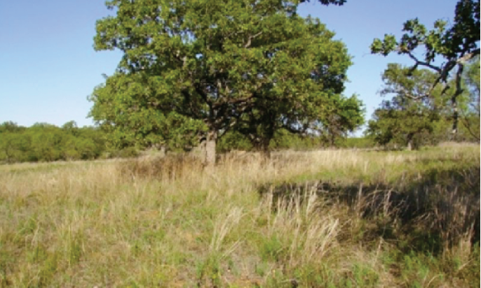
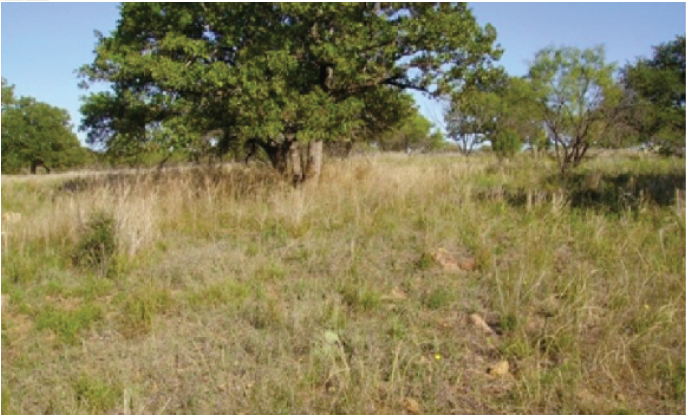
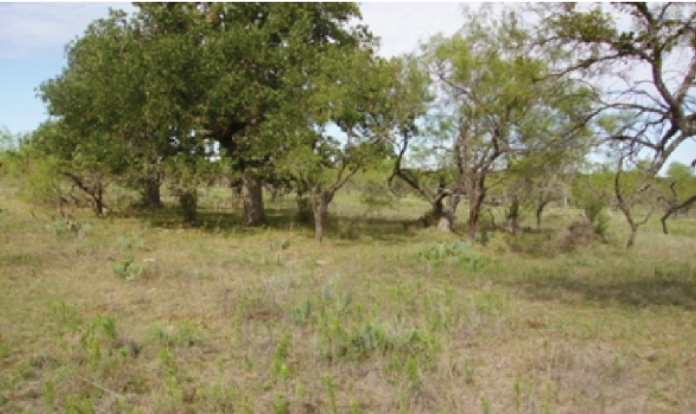

<head>
    <title> Catchment 5769623 </title>
    <link rel="stylesheet" type="text/css" href="styles/style.css">
</head>

Under pre-settlement conditions, the area was a Mixed-grass Savannah (below left)
of mostly midgrasses with tall grasses and scattered trees and shrubs along draws.
Such a community evolved under the influence of grazing and periodic fire.
Today, due to historic overgrazing and the suppression of fire, the area has
transitioned to a Midgrass Savannah Community (below middle) consisting of mid
grass dominated savannah being encroached or invaded by woody species such as
mesquite and brushy species such as Whitebrush. Today, mesquite and white brush
cover over 30% of the catchment. Unless proper grazing, brush management and
prescribed burning are applied, the area could potentially transition to a
Shortgrass/Mixed-brush Community (below right). For more detail see page x.

  
  
Mixed-grass Savannah

  
  
Midgrass Savannah Community

  
  
Shortgrass/Mixed-brush Community

